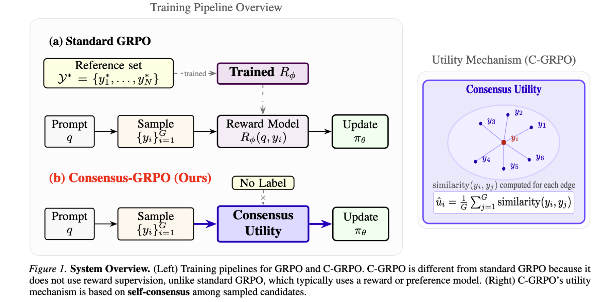

# Consensus Group Relative Policy Optimization for Text Generation


Scripts for MBR/C-GRPO experiments.

The experiments conducted using NVIDIA A100 GPUs with 80 GB of VRAM.
## Structure

- `src/`: main training/evaluation code
- `scripts/`: runnable shell scripts
- `data/`: data prep and utilities
- `dataset/`: dataset directory (after download/creation)

## Usage
- Python 3.12
- cuda:12.6.1-devel-ubuntu22.04
1) Install dependencies


```bash
bash scripts/setup.sh
```

2) Run

```bash
bash scripts/run_c_grpo.sh
```

Use `scripts/run_mbr.sh` for using MBR decoding. You can edit arguments at the top of each script.


